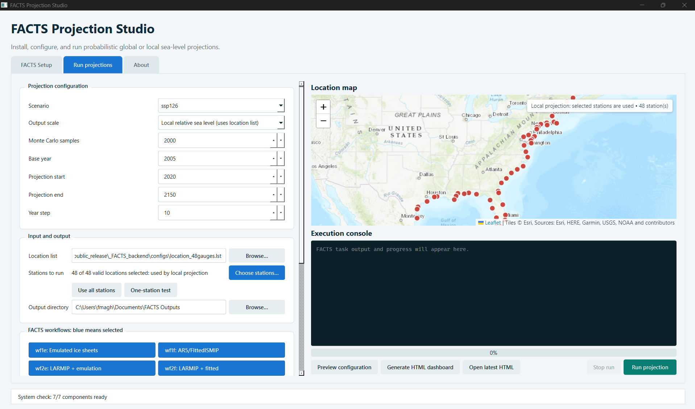

# FACTS Projection Studio

A native Windows desktop interface for installing, configuring, running, and
monitoring the containerized Framework for Assessing Changes To Sea-level
(FACTS), plus a Linux/WSL fallback launcher.

Dashboard developer: Faezeh Maghsoodifar, The University of Alabama.

> **Independent-use disclaimer:** This dashboard was independently developed by
> a FACTS user to make practical use of FACTS easier. It is not affiliated with,
> endorsed by, or maintained by the FACTS development team. FACTS remains an
> independent open-source scientific framework.



## Download

Windows users should download the current packaged ZIP from the repository's
**Releases** page. Extract the complete folder, keep `_FACTS_backend` beside the
executable, and open `Launch FACTS Dashboard.exe`.

This folder does **not** contain the multi-gigabyte FACTS model data or prior
research outputs. The **FACTS Setup** tab downloads and builds the required
components on the destination computer.

## Supported systems

- Windows 10/11 with Docker Desktop and its WSL2 integration
- Native desktop Linux with Python 3/Tk and Docker Engine
- macOS is not supported by this installer

## Start on Windows

1. Install Docker Desktop, use its WSL2 backend, and start Docker Desktop.
2. Copy or extract the complete release folder to a local or synchronized
   Windows directory. Keep `_FACTS_backend` beside the executable and do not
   rename or move files inside it.
3. Open the visible `Launch FACTS Dashboard.exe`. The native application opens first. It
   checks for Ubuntu WSL2 and offers to install it when
   missing. Windows may require administrator approval or a restart. It also
   installs the required Ubuntu Python/Tk, Git, and download utilities.
   The executable is unsigned, so managed Windows
   installations may block it.
4. If the unsigned executable is blocked by an organization-managed Windows
   policy, ask the computer administrator to approve it or provide a signed
   build.
5. The application opens on **FACTS Setup**. Select **Check system**.
6. Select **Full local module data** when local relative-sea-level projections
   are required, then select **Install / repair FACTS**.

After setup, the application opens without starting a scientific run. The user
loads or enters the location data, types or browses to an output directory,
chooses the scenario and workflows, previews the configuration, and then presses
**Run projection**. Windows paths such as `D:\FACTS Results` and WSL/Linux paths
are both accepted for the output directory.

The large download is resumable. Existing repositories, downloaded archives,
configuration backups, and outputs are preserved.

## Start on Linux

Install Git, Docker Engine, Python 3, and Tkinter. Then run:

```bash
chmod +x facts-dashboard run_facts_slr.sh setup_facts.sh
./facts-dashboard
```

## What automated setup does

The setup workflow:

1. verifies the operating system, Git, and Docker engine;
2. clones `pkjr002/facts`, branch `demo/ssisls`, into
   `~/facts_ssisls/facts` when missing;
3. optionally downloads all official FACTS module-data archives;
4. builds the `ssisls` Docker image without duplicating the data archives inside
   the image;
5. clones the interactive results-dashboard repository and builds `facts-viz`;
6. preserves existing installations and reports each action in the Setup console.

The runner does not assume a Windows username or Linux numeric user ID. Before
each run it prepares only the selected SSP experiment directory for the FACTS
container runtime, allowing Docker's `jovyan` account to regenerate
`workflows.yml`, logs, and NetCDF files even when the WSL checkout belongs to a
different user. Other repository and result directories are not changed.

It can request the standard Windows installation of WSL2/Ubuntu when Ubuntu is
missing. Administrator approval and any required restart remain under the
computer owner's control. It does not bypass Windows security prompts, install
Docker Desktop, or change account, privacy, or security settings.

## Location lists

`configs/location_48gauges.lst` is a public example containing 48 NOAA tide-gauge
locations along the U.S. Atlantic and Gulf coasts. In the Run tab, choose
**Browse** to use a different tab-separated file:

```text
NAME<TAB>INTEGER_ID<TAB>LATITUDE<TAB>LONGITUDE
```

Use LF line endings. Site identifiers must be unique integers.

Under **Stations to run**, choose **Choose stations** to check or clear
individual rows without editing the source file. Click a row to toggle it:
**blue rows are selected for the run**, while light rows are unselected.
**Use all stations** restores
the entire list. **One-station test** selects the first valid row for a quick,
lower-cost test. The Run tab plots only the selected rows on an interactive
**Esri World Topographic Map**. Local mode fits the map to the station
coordinates. Global-mean mode has no station points in the scientific result;
it shows the world extent and retains the selected-list markers as a preview.
Click a red marker to see its name, ID, latitude, and longitude. The basemap
needs internet access; FACTS execution still uses the selected rows if map tiles
cannot load. Esri attribution is shown within the map.

## Typical workflow

1. Complete Setup checks.
2. In **Run projections**, choose an SSP, local or global scale, locations,
   workflows, sampling settings, and output directory. Workflow, Vertical Land
   Motion, and Extreme Sea Level options are selection buttons: **blue means
   selected** and light gray means unselected. Use **Clear all** and then select
   only the workflow(s) needed when a full seven-workflow run is unnecessary.
3. Preview the generated configuration.
4. Select **Run projection** and confirm the summarized job.
5. Confirm that the console prints `Selected workflows:` followed by exactly
   the requested names. FACTS first performs a debug-only pipeline inspection,
   then bases the progress total on the actual selected pipeline instead of the
   full seven-workflow 68-task run.
   Each run is written to its own timestamped folder under `FACTS_runs`, so a
   new one-station or one-workflow result cannot be mixed with older outputs.
6. Select **Generate HTML dashboard** after successful completion. The bundled
   control runs the installed `facts-viz` image and writes a self-contained HTML
   file into the selected output directory. Select **Open latest HTML** to view
   it in the default browser.

## Troubleshooting

- **Docker engine stopped:** start Docker Desktop or the Linux Docker service.
- **Blank map:** confirm internet access to Esri and `unpkg.com`; the location
  list remains usable even when the basemap is unavailable.
- **`python3-tk` missing:** on Ubuntu run
  `sudo apt update && sudo apt install -y python3-tk`.
- **Executable blocked:** ask the computer administrator to approve the unsigned
  application or provide a signed build. Publicly distributing a broadly trusted
  `.exe` requires a recognized code-signing certificate.
- **Interrupted data download:** run Install/repair again with full local data
  selected; completed files are retained and partial downloads resume.

## Verification on another computer

For a low-cost test, first install the core without full local data and confirm
that both Setup and Run tabs open. Then enable full data. Before a large study,
load a one-location list, select one workflow, use a small sample count, and run
a smoke test. Do not treat a reduced smoke test as research output.

See `THIRD_PARTY_NOTICES.md` for upstream projects and licenses.

## Rebuilding the Windows interface

Run `packaging\build_windows.ps1` from PowerShell. It creates a clean
`public_release` folder containing the visible executable and one
`_FACTS_backend` folder. Build products are intentionally excluded from Git.
